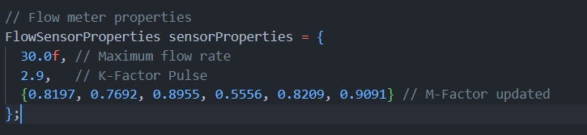

# Fuel Tank IoT Code

THis Code to run esp32 and sensors

## What Tools Did I Use?

- ESP32
- Flow Sensor AICHI
- Ultrasonic Sensor HC-SR04
- Relay 4 Channel
- MQ-2
- SEN-0004
- Push Button
- Buzzer

## How To Configure Flow Sensor?

- calibration_flow_meter code for find K-Factor
- Flow 1 liter of liquid to the flow sensor and check on the serial monitor K-Factor and Pulse
- After that, input the K-Factor in the flowSensorProperties in the projectCode.
- if it still misses fill in the M-Factor value with the Actual / Sensor Value comparison
- Example flowSensorProperties

  
